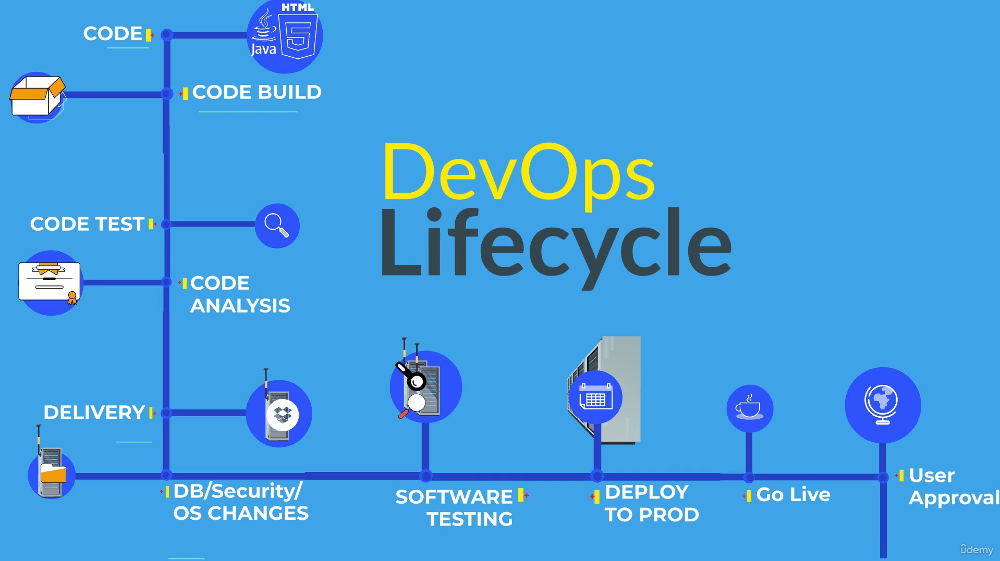

## 1. **Software Development Life Cycle (SDLC)**  

1. The Software Development Life Cycle (SDLC) is a series of phases used to develop software from scratch to deployment and maintenance.

2. It contains many phases like -
	
	1. **Requirement Analysis**
	2. **Planning**
	3. **Designing**
	4. **Development**
	5. **Testing**
	6. **Deployment**
	7. **Maintenance**
### 1.1 Models Of SDLC

1. **Waterfall Model**l  :-  
	1. Very old model and used only for small projects
	2. In this models we have different phases - Requirement ->  Design -> Development  -> Testing -> Maintenance 
	3. In this model we cannot move to previous steps so changing the plans is not a good option here.
	
2. **Agile Model**  :- 
	1.  Divides the project requirements into multiple small stages (iterations/sprints).
	2. Delivers working software at the end of each sprint.
	3. Encourages continuous customer feedback throughout the development process.
	4. Easily adapts to changing requirements, even late in development.
	5.  Promotes collaboration between developers, testers, and stakeholders.
	6. Testing is performed continuously during each sprint.
		
3. **Spinal Model**  -:
	1.  Combines the features of the Waterfall and Prototyping models.
	2. Development is carried out in multiple iterations (spirals).
	3.  Focuses on **risk analysis** at every phase.
	4. Suitable for large, complex, and high-risk projects.

4. **Big Bang Model**:-
	1. There is little or no planning before development begins.
	2. Developers start coding based on the available requirements.
	3. Suitable for small or experimental projects.
	4. Flexible and easy to implement.
	5. High risk due to lack of proper planning. 
## 2.  Devops Life Cycle 

To Avoid the communications between ops team dev team (DevOps was introduced to bridge the communication gap between the Development (Dev) and Operations (Ops) teams. The Development team follows Agile methodology, where changes are made frequently in short iterations, while the Operations team traditionally followed the Waterfall model, making deployments slower and more difficult. Due to continuous changes and a lack of clear coordination, the Ops team often struggled to deploy applications efficiently. DevOps improves collaboration, automation, and communication, enabling faster and more reliable software deployment.)

Here are some stages of the Devops life cycle

1. Developers commit the code 
2. Code Build - Deploy the Artifacts 
3. Test the code - Unit and Integration testing
4. Code Analysis
5. Delivery - Deploy the changes for staging
6. Databases changes - It contains other changes from the OPS team
7. Software Testing - QA Functional testing and Performance Testing
8. Deploy to Production 
9. Go Live - If users experiencing traffic so changes made here to avoid lack of performance
10. User Approval - Get feedback relates to the software/Product
11. Keep Monitoring

That is how Devops life cycle works 

